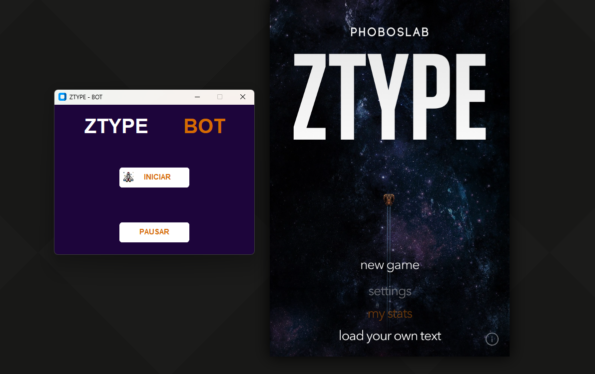

# ztype_Botgame

Bot utilizando reconhecimento de img e texto para auxiliar nas fases do ztype
Este projeto utiliza o CustomTkinter para a interface gráfica e o Pytesseract para o reconhecimento de imagem, com o objetivo de aprimorar o conhecimento em técnicas de reconhecimento de imagem.

O bot é projetado para analisar a tela de jogo do ZType, identificando elementos de texto, como palavras ou frases que precisam ser digitadas. Ao usar o Pytesseract, ele extrai dados textuais de capturas de tela, permitindo que o bot determine as palavras a serem digitadas.

Com essa configuração, o bot pode ajudar os jogadores reconhecendo palavras ou frases que surgem no jogo, fornecendo assistência ou automatizando sua digitação com precisão e rapidez.

Por meio deste projeto, o objetivo não é apenas criar um bot funcional, mas também aprofundar-se nas complexidades do reconhecimento de imagem, compreendendo suas aplicações e limitações em cenários práticos, como ambientes de jogos.

---

link do game = https://zty.pe/

recomendado deixar o browser em tela cheia pressionando F11 (caso estiver no windows,Chrome)

---

---

Para o codigo Funcionar perfeitamento é necessario instalar algumas bibliotecas:
--->import time
--->from pytesseract import pytesseract
--->import pyautogui

a biblioteca pytesseract tera que instalar um executavel alem de usar o pip install
que se encontra neste link:https://github.com/UB-Mannheim/tesseract/wiki

duvidas na instalaçao do exe este video ira te ajudar: https://www.youtube.com/watch?v=jailqGRNAgw

---

---

As variaveis Abaixo São cordenadas apenas para o print da tela sair recortado no local onde esta o tela inicial do game.
Caso nao delimitar essas posições o print vai sair da tela inteira e o codigo pode puxar textos
que estão no seu navegador. Dica: utilize a biblioteca "MouseInfo" para saber as posições x y
da tela inicial do game.

x = 658 # coordenada x do canto superior esquerdo
y = 80 # coordenada y do canto superior esquerdo
width = 800 # largura do retângulo
height = 1000 # altura do retângulo

---
